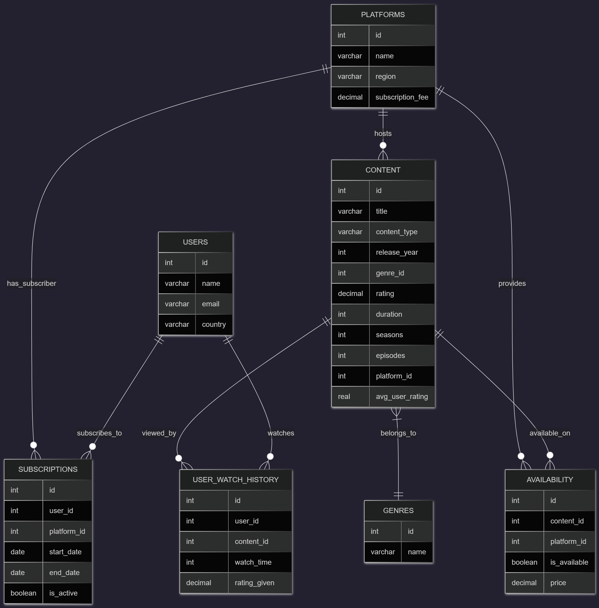

# **Design Document**

By **Prajwal Abhish Lingayath**

Video overview: **Video Overview:** [https://youtu.be/1OvNyOLE39g](https://youtu.be/1OvNyOLE39g)

---

## **Scope**

### **Purpose**

The purpose of this database is to create a **unified streaming content aggregator** that consolidates data from major streaming platforms such as **Netflix**, **Amazon Prime Video**, and **Disney+**.
It provides a single structured source for querying content availability, ratings, user subscriptions, and viewing behavior.

The system aims to help:

* **Users** discover where specific content is available.
* **Analysts** perform data analysis on content performance, popularity, and engagement.
* **Platform providers** understand trends and user activity across services.

---

### **Included in Scope**

The database covers the following:

* **Streaming platforms** (Netflix, Prime Video, Disney+)
* **Movies and TV shows** (title, type, year, genre, rating)
* **Genres** for classifying content
* **Users** and their viewing behavior
* **Subscriptions** between users and platforms
* **Availability** of content across multiple platforms
* **User watch history**, including individual ratings and watch duration

---

### **Outside Scope**

This project **does not** include:

* Detailed cast, crew, or production company data
* Real-time API integration or automatic data fetching
* Recommendation algorithms
* User authentication or account management system
* Regional licensing restrictions beyond a simple region field

---

## **Functional Requirements**

### **In-Scope Features**

Users should be able to:

1. **Search** for movies or shows across all platforms.
2. **View availability** of content on different platforms.
3. **See top-rated content**, movies, or shows.
4. **Track user subscriptions**, including start and end dates.
5. **Record watch history** and user-provided ratings.
6. **Automatically update** content ratings when new ratings are added.
7. **Run analytics queries**, such as:

   * Average rating by genre or platform
   * Most watched content per user
   * Most subscribed platform
   * Active users count

### **Out-of-Scope Features**

* Personalized recommendations
* Video playback or streaming capabilities
* Integration with payment systems
* Real-time user tracking
* User authentication or security systems

---

## **Representation**

### **Entities**

| Entity                 | Description                                  | Key Attributes                                                                                 | Constraints                                                    |
| ---------------------- | -------------------------------------------- | ---------------------------------------------------------------------------------------------- | -------------------------------------------------------------- |
| **Platforms**          | Streaming services                           | `id`, `name`, `region`, `subscription_fee`                                                     | `name` UNIQUE                                                  |
| **Genres**             | Classification of content                    | `id`, `name`                                                                                   | `name` UNIQUE                                                  |
| **Content**            | Movies and TV shows                          | `id`, `title`, `content_type`, `release_year`, `genre_id`, `rating`, `duration`, `platform_id` | `content_type` CHECK (Movie/Show), FK to `genres`, `platforms` |
| **Users**              | People using the platforms                   | `id`, `name`, `email`, `country`                                                               | `email` UNIQUE                                                 |
| **Subscriptions**      | Link between users and platforms             | `id`, `user_id`, `platform_id`, `start_date`, `end_date`, `is_active`                          | FKs to `users`, `platforms`                                    |
| **Availability**       | Which content is available on which platform | `id`, `content_id`, `platform_id`, `is_available`, `price`                                     | FKs to `content`, `platforms`                                  |
| **User Watch History** | Tracks user activity                         | `id`, `user_id`, `content_id`, `watch_time`, `rating_given`                                    | FKs to `users`, `content`                                      |

All entity attributes use appropriate types:

* **VARCHAR** for text values (names, emails, titles)
* **INT** for identifiers and durations
* **DECIMAL** for prices and ratings
* **DATE** for subscription periods
* **BOOLEAN** for true/false flags

Primary keys (`id`) ensure uniqueness, and **foreign keys** enforce relational integrity.

---

### **Relationships**

#### Entity Relationship Diagram

#### **Relationship Summary**

1. **Users ↔ Subscriptions ↔ Platforms**: Many-to-many
   A user can subscribe to multiple platforms; a platform has many subscribers.
2. **Content ↔ Genres**: Many-to-one
   Each content item has one genre.
3. **Content ↔ Platforms ↔ Availability**: Many-to-many
   A movie/show can be available on multiple platforms.
4. **Users ↔ Content ↔ User Watch History**: Many-to-many
   Tracks which users have watched which content and how they rated it.

---

## **Optimizations**

### **Indexes**

| Index               | Purpose                                      |
| ------------------- | -------------------------------------------- |
| `idx_content_title` | Fast search by content title                 |
| `idx_user_watch`    | Efficient retrieval of watch history by user |
| `idx_genre_name`    | Quick filtering by genre                     |
| `idx_platform_name` | Speeds up platform lookups                   |

### **Views**

| View                   | Description                                             |
| ---------------------- | ------------------------------------------------------- |
| `top_rated_content`    | Top 20 rated titles (movies and shows)                  |
| `top_rated_movies`     | Top 20 rated movies                                     |
| `top_rated_shows`      | Top 20 rated shows                                      |
| `active_subscriptions` | Lists all currently active subscriptions                |
| `platform_subscribers` | Shows total subscribers per platform                    |
| `user_watch_summary`   | Aggregates total watch time and average rating per user |

### **Triggers**

* **`update_content_rating`**
  Updates the average rating of a movie or show automatically whenever a new rating is inserted into the `user_watch_history` table.
  This ensures the content’s rating always reflects real user input.

---

## **Limitations**

1. **Simplified genre and cast system** — Only one genre per content and no cast or crew details.
2. **No regional licensing model** — Region column is not linked to content availability by geography.
3. **No rating history tracking** — Only average rating is stored; rating trends over time are lost.
4. **No user authentication or privacy handling** — This is a purely analytical dataset.
5. **Data volume** — Designed for demonstration and academic analysis, not large-scale production.

---
